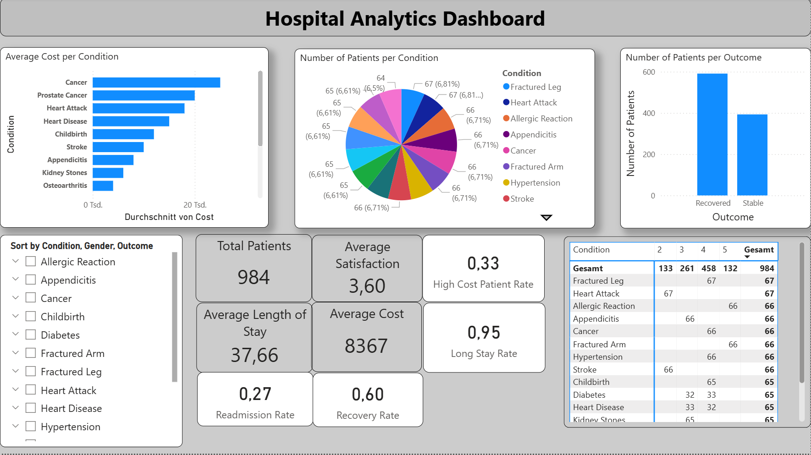

# Hospital Analytics Dashboard (Power BI)

## Project Overview

This project is a **Hospital Analytics Dashboard built in Power BI** to analyze patient data, treatment costs, outcomes, and satisfaction levels.
The dashboard is designed in the style of a **business intelligence executive report**, but focused on healthcare performance and quality metrics.

It provides an interactive overview of:

* Patient volume and conditions
* Treatment costs
* Length of stay
* Outcomes and readmission rates
* Patient satisfaction

The goal of this project is to demonstrate data modeling, DAX measures, and dashboard design skills using a healthcare-themed dataset.

---

## Dashboard Preview

*(Replace with your actual screenshot file name)*

---

## Key Features

* **Executive KPI cards** for quick insights:

  * Total Patients
  * Average Satisfaction
  * Average Length of Stay
  * Average Cost
  * Readmission Rate
  * Recovery Rate
  * High Cost Patient Rate
  * Long Stay Rate

* **Interactive visualizations:**

  * Average Cost per Condition (bar chart)
  * Number of Patients per Condition (pie chart)
  * Number of Patients per Outcome (column chart)
  * Patient distribution table by condition and satisfaction level

* **Dynamic filtering (slicers):**

  * Condition
  * Gender
  * Outcome

* **Professional hospital-themed design** using a custom Power BI theme (medical blue, teal, and neutral colors)

---

## KPIs & Metrics

The dashboard includes the following calculated measures using DAX:

* Total Patients
* Average Cost per Patient
* Average Length of Stay
* Readmission Rate (%)
* Recovery Rate (%)
* Average Satisfaction Score
* High Cost Patient Rate (%)
* Long Stay Rate (%)
* Low Satisfaction Rate (%)
* Cost per Day

These KPIs allow both operational and quality-of-care analysis.

---

## Dataset

The dataset contains simulated hospital patient records with the following fields:

* `Patient_ID`
* `Age`
* `Gender`
* `Condition`
* `Procedure`
* `Cost`
* `Length_of_Stay`
* `Readmission`
* `Outcome`
* `Satisfaction`

Total records: **984 patients**

This dataset was used for educational and analytical purposes only.

---

## Tools & Technologies

* **Power BI Desktop**
* **Power Query** (data cleaning & transformation)
* **DAX** (calculated measures and KPIs)
* **Custom Power BI Theme (JSON)**
* GitHub for version control and documentation

---

## Dashboard Structure

### Page 1 – Hospital Overview

* KPI summary cards
* Cost by condition
* Patients by condition
* Outcomes distribution
* Filter panel (Condition, Gender, Outcome)

This page provides a high-level executive summary of hospital performance.

---

## Design & Usability

* Hospital-themed color palette (blue, teal, white, light gray)
* Consistent KPI card layout
* Compact slicer panel
* Clear titles and labels
* Business-style dashboard structure adapted for healthcare analytics

---

## How to Use

1. Clone or download this repository
2. Open the `.pbix` file using **Power BI Desktop**
3. (Optional) Import the provided theme file via:

   * **View → Themes → Import theme**
4. Use slicers to filter by:

   * Condition
   * Gender
   * Outcome
5. Explore KPIs and visual insights interactively
